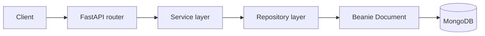

# Architektura

## Warstwy

- `routers`: endpointy HTTP.
- `services`: logika biznesowa.
- `repositories`: dostep do bazy danych.
- `models`: dokumenty Beanie i modele osadzone.
- `schemas`: schematy request/response dla API.
