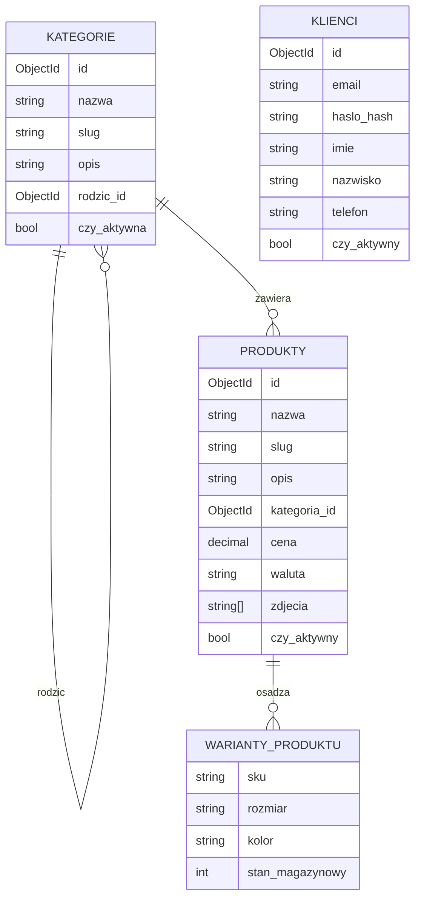

# Schemat bazy danych

Podstawowy schemat sklepu zostawia tylko najwazniejsze kolekcje:
kategorie, produkty i klientow zakladajacych konto.

```mermaid
erDiagram
    KATEGORIE ||--o{ KATEGORIE : rodzic
    KATEGORIE ||--o{ PRODUKTY : zawiera
    PRODUKTY ||--o{ WARIANTY_PRODUKTU : osadza

    KATEGORIE {
        ObjectId id
        string nazwa
        string slug
        string opis
        ObjectId rodzic_id
        bool czy_aktywna
    }

    PRODUKTY {
        ObjectId id
        string nazwa
        string slug
        string opis
        ObjectId kategoria_id
        decimal cena
        string waluta
        string[] zdjecia
        bool czy_aktywny
    }

    WARIANTY_PRODUKTU {
        string sku
        string rozmiar
        string kolor
        int stan_magazynowy
    }

    KLIENCI {
        ObjectId id
        string email
        string haslo_hash
        string imie
        string nazwisko
        string telefon
        bool czy_aktywny
    }
```
